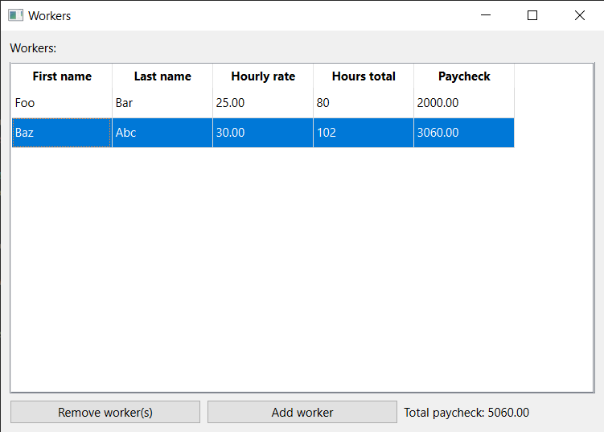
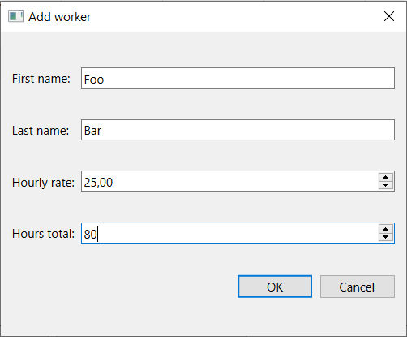

# Workers

Simple app summing up worker paychecks using Qt.

# License

This project is licensed under GNU LGPL version 3
because I don't know if I can use MIT or something like that with Qt. 
See [LICENSE](LICENSE) file for more info.

Please don't sue me.

